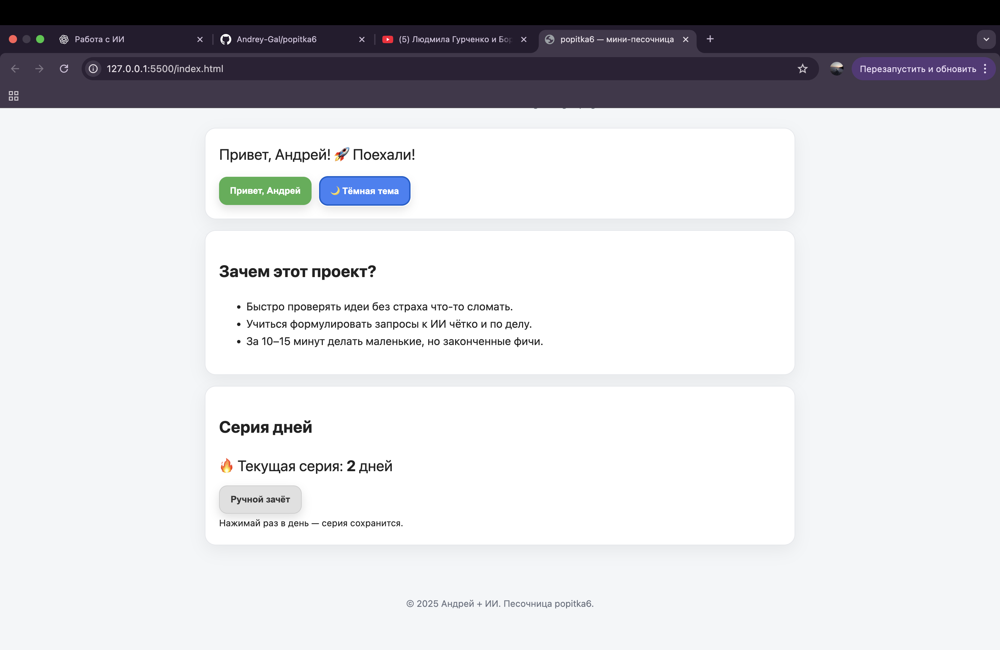

# Popitka6




✨ Тренировочный проект Андрея + ИИ
Учимся писать код, работать с Git и GitHub, шаг за шагом 🚀

## 🚀 Демо
👉 [Открыть проект](https://andrey-gal.github.io/popitka6/)

## ⚡ Функционал
- Переключение темы (светлая / тёмная)
- Приветственное сообщение «Привет, Андрей!»
- Счётчик серии дней (стрик)
- Кнопка ручного зачёта
- ⌨️ Горячие клавиши (G — привет, T — тема, Enter — зачёт, Shift+Enter — сброс)
## ⌨️ Горячие клавиши

- **G** — «Привет, Андрей» (и автозачёт серии)
- **T** — переключить тему (сохраняется в `localStorage`)
- **Enter** — засчитать день
- **Shift + Enter** — сброс серии (с подтверждением)

> Подсказка: хоткеи не срабатывают, если курсор в `input/textarea/select`.
> Скрытый сброс также доступен кликом по кнопке «Ручной зачёт» с зажатым **Shift**.


## 🛠️ Используемые технологии
- HTML
- CSS
- JavaScript

## ⚙️ Аналогия с моей профессией

Я работаю оператором упаковочной машины **FOCKE 701**, которая идёт со скоростью **700 пачек в минуту в два канала**.
На работе мне нужно быть предельно внимательным: следить за качеством продукции, технологией упаковки и вовремя замечать малейшие неисправности.

🛠 Этот опыт напрямую помогает мне в программировании:

- **Подача продукта → написание кода**
  Сигареты подаются в машину → я пишу новую фичу или функцию.

- **Формирование пачки → сборка задачи**
  Все сигареты должны лечь ровно → код должен быть логично собран и структурирован.

- **Обёртка и упаковка → commit**
  Плёнка обтягивает пачку → я фиксирую изменения в Git через `git commit`.

- **Контроль качества → отладка и тесты**
  Глаз намётан на ошибки → я замечаю баги и исправляю их до того, как они «уедут дальше по конвейеру».

- **Выход готового продукта → push на GitHub**
  Готовые пачки едут на склад → мой код публикуется на GitHub и становится доступен другим.

⚡️Вывод: мой «глаз намётанный» на производстве — это навык, который теперь помогает мне и в программировании.

## 👤 Автор
Андрей Галкин
[GitHub профиль](https://github.com/Andrey-Gal)

## 🗓 Мой цикл

👉 [Открыть расписание](https://andrey-gal.github.io/popitka6/schedule.html)

## 🔥 Стрик (счётчик серии)

Сохраняет «сколько дней подряд я занимался».

### Как это работает
- Хранит **два ключа** в `localStorage`:
  - `andrey_streak_count` — текущее число дней в серии.
  - `andrey_streak_daynum` — номер календарного дня (целое число в днях от эпохи **по локальной полуночи**).
- Такой формат устойчив к смене часовых поясов и летнему времени.

### Режим отладки
Добавь к адресу `?debug=1`
Пример: `https://andrey-gal.github.io/popitka6/?debug=1`
Под счётчиком появится строка вида:

## Что нового
**23.08.2025** — добавлены **«Цитата дня»** и **DEBUG-режим**.

## Фичи (обновлено)
- 🌗 Светлая/тёмная тема (сохраняется в `localStorage`).
- 👋 Кнопка «Привет, Андрей» — меняет фразу и засчитывает день в серии.
- 🔥 **Серия дней (стрик)** — честный подсчёт по локальной полуночи.
- 📝 **Цитата дня** — одна цитата в сутки + кнопка «Скопировать».
- 📅 Страница `schedule.html` — мой 8-дневный цикл.
- 🔗 Ссылки на портфолио (демо и исходники).

## Как это работает

### Стрик
- Ключи:
  - `andrey_streak_count` — текущее число дней
  - `andrey_streak_daynum` — номер календарного дня (локальная полночь)
- Правила:
  - Если последний день = сегодня → уже засчитано.
  - Если последний день = вчера → `count + 1`.
  - Иначе → `count = 1`.
- Засчитать можно кнопкой «Ручной зачёт» или кликом по «Привет, Андрей».

### Цитата дня
- Ключи:
  - `andrey_quote_index` — индекс текущей цитаты
  - `andrey_quote_daynum` — день, когда цитата обновилась
- Обновляется раз в сутки (по локальной полуночи). Есть кнопка **«Скопировать»**.

### DEBUG-режим
Добавь `?debug=1` к адресу страницы, чтобы увидеть служебные строки:

## Фичи

- **Темы:** светлая/тёмная (переключатель, состояние в `localStorage`).
- **Серия дней (streak):**
  - Ручной зачёт и автозачёт при клике «Привет, Андрей».
  - Устойчива к часовым поясам (счёт идёт по «локальной полуночи»).
  - Мини-индикатор цели: **`X / 7`** и “осталось N”.
  - 7 точек-прогресс; при серии `> 7` отображается `7/7 ✅ (+N)`.
  - **Сброс:** `Shift` + клик по кнопке «Ручной зачёт».
  - **Отладка:** добавь `?debug=1` к адресу страницы — появится строка DEBUG.
  - Ключи: `andrey_streak_count`, `andrey_streak_daynum`.
- **Цитата дня:** одна из заранее заданных фраз, меняется раз в сутки; есть кнопка «Скопировать».
- **8-дневный цикл смен:** отдельная страница `schedule.html` (выбор стартовой даты и типа дня, ежедневные чекбоксы).

## Локальный запуск

```bash
# любой статический сервер; пример с live-server
live-server
# или через VS Code: "Open with Live Server"

- QA: см. [qa/SMOKE.md](qa/SMOKE.md)

# Popitka6 — мини-песочница Андрея

Учебный проект по фронтенду: светлая/тёмная тема, «Привет, Андрей», серия дней (streak) c мини-прогрессом 7/7, «Цитата дня», хоткеи, и отдельная страница с моим 8-дневным циклом.


**Демо:** https://andrey-gal.github.io/popitka6/
**Исходники:** https://github.com/Andrey-Gal/popitka6

---

## 🔧 Что внутри

- 🌗 Переключатель темы (сохранение в `localStorage`)
- 👋 «Привет, Андрей» — меняет фразу и автоматически засчитывает день в серии
- 🔥 **Streak**: учёт серии по «локальной полуночи», устойчив к часовым поясам
  - Ручной зачёт (1 раз в сутки)
  - Скрытый **сброс** серии: `Shift + клик` по «Ручной зачёт» **или** `Shift + Enter`
  - Мини-прогресс **7 точек** + подсказка «цель 7/7»
  - **Бэкап/восстановление** серии (встроенная панель импорта)
- 💬 **Цитата дня** — одна цитата на сутки + кнопка «Скопировать»
- ⌨️ **Хоткеи**:
  `G` — «Привет, Андрей» · `T` — тема · `Enter` — зачёт · `Shift+Enter` — сброс
- 🗓 **Мой цикл**: отдельная страница `schedule.html` с настройкой старта и чекбоксами на сегодня

---

## 🖱 Как пользоваться

1. Открой `index.html` (или демо по ссылке выше).
2. Жми **«Привет, Андрей»** — фраза сменится, день зачтётся.
   Либо нажми **«Ручной зачёт»**.
3. Если нажал уже сегодня — появится ненавязчивый тост «Сегодня уже засчитано ✅».
4. Мини-прогресс под серией показывает путь к цели **7 дней**.

> Отладка: добавь к адресу `?debug=1` (например: `.../index.html?debug=1`) — появится строка с техническими значениями.

---

## 💾 Бэкап/восстановление серии

- **Скопировать бэкап** — положит строку вида `andrey-streak:...` в буфер обмена.
- **Восстановить** — сначала попытается прочитать буфер.
  Если доступ запрещён, откроется панель — просто вставь строку бэкапа и нажми **«Импортировать»**.

> Не хочешь, чтобы панель импорта появлялась автоматически?
> В `script.js` закомментируй две строки, которые вызывают `showImportBox(...)` внутри `catch` в функциях `exportStreak()` и `importStreakFromClipboard()`.

---

## 🗂 Структура


> Daily checkpoint: 2025-09-03 22:39

- Двойной клик по строке «Серия дней» — засчитать день.
